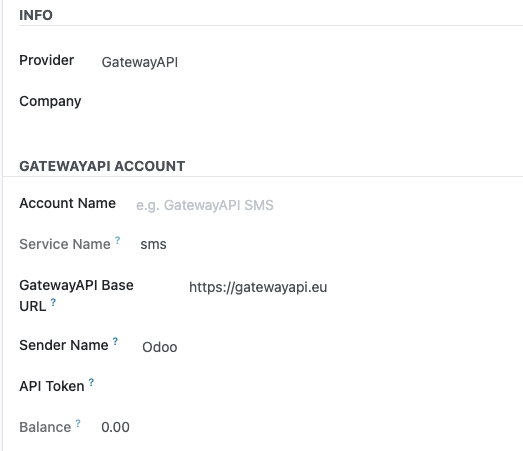
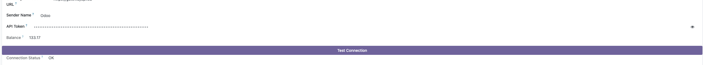
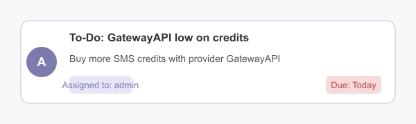
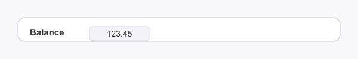
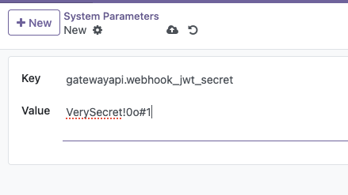

# GatewayAPI SMS Connector for Odoo 17

Send SMS messages directly from Odoo using the GatewayAPI service. This module replaces the default Odoo SMS IAP with a secure, feature-rich GatewayAPI integration.

---

## Features

- **Send SMS via GatewayAPI**: Seamless integration with GatewayAPI for reliable SMS delivery.
- **Secure API Token Management**: Show/hide your API token in the form with a single click.
- **Secure webhook JWT token for delivery reports**: Delivery report webhooks are protected using a JWT token, ensuring only authorized requests from GatewayAPI are processed.
- **Credit Balance Monitoring**: Set minimum credit thresholds and receive notifications when your balance is low.
- **Per-Account Credit Check Scheduling**: Configure individual credit check intervals (e.g., daily, hourly) for each GatewayAPI account.
- **Admin Activity Notifications**: Automatic admin alerts (To-Do activities) when credits run low.
- **Direct Email Notifications**: Receive low credit alerts at a user-defined email address.
- **Batch Sending**: Efficiently send multiple SMS messages to GatewayAPI in batches.
- **Easy Configuration**: Intuitive form layout and clear help texts.
- **Odoo 17 Compatible**: Built and tested for Odoo 17.

---

## Requirements

- **Odoo Apps**:
  - `iap_alternative_provider`
  - `phone_validation`
- **Python Packages**:
  - `phonenumbers`
  - `requests`
  - `pyjwt` (for webhook JWT verification)

Install Python dependencies, probably in your python venv, with:

```sh
pip install phonenumbers requests pyjwt
```

---

## Installation

### From Odoo Apps Store

1. Download the module ZIP from the Odoo Apps Store.
2. Extract the ZIP and place the `gatewayapi_sms` folder in your Odoo `custom addons` directory.
3. Restart your Odoo server.
4. Activate Developer Mode in Odoo.
5. Go to Apps, click 'Update Apps List', then search for **GatewayAPI SMS Connector** and install it.

### From GitHub

1. Clone the repository:

   ```sh
   git clone https://github.com/waltherB/gatewayapi_sms.git
   ```

2. Move the `gatewayapi_sms` folder to your Odoo `addons` or `custom addons` directory.
3. Install the required Python packages (see above).
4. Restart your Odoo server.
5. Activate Developer Mode in Odoo.
6. Go to Apps, click 'Update Apps List', then search for **GatewayAPI SMS Connector** and install it.

---

## Configuration

1. Go to **Settings > Technical > IAP Accounts**.
2. Create a new account or edit an existing one.
3. Set the Provider to "GatewayAPI" in the dropdown. (If you fill in the GatewayAPI Base URL and API Token directly, the 'Provider' field will automatically be set to 'GatewayAPI'.)
4. Fill in the required fields:
   - **Name**: Give your account a name (e.g., "GatewayAPI SMS")
   - **Service Name**: Must be `sms`.
   - **GatewayAPI Base URL**: Default is `https://gatewayapi.eu`
   - **Sender Name**: Set your preferred sender name.
   - **API Token**: Obtain from your GatewayAPI dashboard.
   - **Minimum Credits**: Set a threshold for low credit notifications.
   - **Credit Check Interval**: Configure how often to check your balance.
5. Click **Test Connection** to verify your setup. The result will be shown in the *Connection Status* field.
6. Use the eye/eye-slash button to show/hide your API token securely.

### Important Notes for Odoo 17

In Odoo 17, the SMS provider system has been simplified, but GatewayAPI will still work correctly with this module. When you configure an account with GatewayAPI settings (API token and base URL), the module will automatically:

1. Recognize it as a GatewayAPI-enabled account (shown with blue highlight in the list)
2. Use it for sending SMS instead of the default Odoo SMS gateway
3. Enable all GatewayAPI features like balance monitoring and notifications

You'll find GatewayAPI accounts in the standard IAP Accounts list, highlighted in blue.

---

## Usage

- Send SMS from Odoo using any of your configured GatewayAPI accounts.
- Receive admin notifications when a specific GatewayAPI account's credit balance drops below its set threshold.
- Automated credit balance checks are managed by a system-level scheduled action that runs frequently. The actual checking of each GatewayAPI account's balance is determined by the individual "Credit check interval" settings on that account's form.

### Understanding Credit Check Scheduling

The module utilizes a master cron job named **"GatewayAPI: Check credit balance"** (with XML ID `ir_cron_check_tokens` found in `data/ir_cron.xml`) to manage credit balance checks. This master job runs periodically.

When the master cron job executes, it calls a method that iterates through all your IAP Accounts that are configured for GatewayAPI and have the "Check for minimum credits" feature enabled. For each of these accounts, the system then refers to its individual "Credit check interval" and "Last Credit Check Time" fields. If the specified interval has passed since the last check for that particular account, its balance will be queried from GatewayAPI, and the "Last Credit Check Time" for that account will be updated.

**Important Note on Precision:** For an account's specific check interval (e.g., every 10 minutes) to be effective with high precision, the **Master Cron Job itself must be configured to run frequently enough.**

For example, if you set an account's check interval to 10 minutes, but the "GatewayAPI: Check credit balance" cron job in Odoo's Scheduled Actions (Settings > Technical > Automation > Scheduled Actions) is set to run only every 1 hour, then your account will effectively only be evaluated for a check on an hourly basis. To achieve checks closer to every 10 minutes for that account, you should adjust the schedule of the "GatewayAPI: Check credit balance" master cron job itself.

#### How to Adjust the Master Cron Schedule:

The schedule for the "GatewayAPI: Check credit balance" (ID: `ir_cron_check_tokens`) is defined in the file `data/ir_cron.xml` within the `gatewayapi_sms` module.

To change its frequency, you can edit this file. For example, to make it run every 10 minutes:

```xml
<record id="ir_cron_check_tokens" model="ir.cron">
    ...
    <field name="interval_number">10</field>
    <field name="interval_type">minutes</field>
    ...
</record>
```

After saving this change, you must restart your Odoo server and update the `gatewayapi_sms` module (e.g., from the Apps menu or using `odoo-bin -u gatewayapi_sms ...`) for the new schedule to take effect. Alternatively, you can modify the schedule directly via Odoo's UI under **Settings > Technical > Automation > Scheduled Actions** by finding the "GatewayAPI: Check credit balance" job and editing its "Execute Every" value.

---

## Screenshots

| Configuration | Test Connection | Notification | Balance |
|---------------|----------------|--------------|---------|
|  |  |  |  |

### Example: JWT Verification Screenshot

This screenshot shows the JWT verification process:



---

## Low Credit Notifications

When an account's credit balance falls below its configured "Minimum Credits" threshold, the system initiates the following notifications:

1.  **Admin Activity (To-Do)**:
    *   A To-Do activity is created and assigned to the Administrator (or the user who triggered the check if the admin user is not found/accessible).
    *   **Summary**: "GatewayAPI low on credits for {Account Name}"
    *   **Note**: Contains details about the low balance, current credits, and the minimum threshold, formatted in HTML.
    *   This activity will appear in the assigned user's activity stream and Odoo's chatter for the IAP Account.

2.  **Direct Email Notification** (if configured):
    *   If "Enable Low Credit Email Alert" is checked on the IAP Account form and a valid "Low Credit Notification Email" address is provided, an email will be sent directly to that address.
    *   The email content is similar to the admin activity note, providing details about the low balance.
    *   The "from" address for this email is determined by Odoo's standard email configuration (company email, then current user's email, then system mail server's default).

The specific actions performed (like creating the activity and sending the email) are triggered by the "Credits notification action" (field `gatewayapi_token_notification_action`) configured on the IAP Account. By default, this is set to "GatewayAPI: Send Low Credits Notification" (`gatewayapi_sms.low_credits_notification_action`), which calls the `send_low_credits_notification` method on the `iap.account` model.

---

## Delivery Status Updates (Webhooks)

To receive final delivery statuses for your sent SMS messages (e.g., DELIVERED, FAILED, EXPIRED), you need to configure a webhook in your GatewayAPI dashboard. This allows GatewayAPI to send Delivery Reports (DLRs) back to your Odoo instance.

### Webhook Configuration

1. **Webhook URL**:

   ```sh
   https://<your_odoo_domain>/gatewayapi/dlr
   ```

   Replace `<your_odoo_domain>` with the actual public domain name or IP address of your Odoo server.

2. **JWT Authentication**:
   - The module uses JWT (JSON Web Token) verification for webhook security.
   - GatewayAPI sends the JWT in the `X-Gwapi-Signature` header.
   - The token is verified using a shared secret configured in Odoo.

3. **JWT Secret Setup**:
   1. Activate Developer Mode in Odoo.
   2. Go to **Settings > Technical > Parameters > System Parameters**.
   3. Create or edit the parameter with:
      - Key: `gatewayapi.webhook_jwt_secret`
      - Value: Your GatewayAPI webhook secret (must match the secret in GatewayAPI dashboard)
   4. Save the parameter.

4. **Optional: Disable JWT Verification** (for testing or development):
   - If you want to disable JWT verification (not recommended for production), create another parameter:
     - Key: `gatewayapi.webhook_require_jwt`
     - Value: `false`
   - When disabled, the webhook will accept requests without the `X-Gwapi-Signature` header.
   - This is useful for testing webhook functionality without JWT setup.
   - **Security Note**: Only disable JWT verification in development/testing environments.

### Status Mapping

The module maps GatewayAPI delivery statuses to Odoo's SMS states:

| GatewayAPI Status | Odoo State | Failure Type (if error) |
|-------------------|------------|------------------------|
| DELIVERED         | sent       | -                      |
| ACCEPTED          | sent       | -                      |
| UNDELIVERABLE     | error      | sms_unregistered       |
| REJECTED          | error      | sms_blacklist          |
| EXPIRED           | error      | sms_other              |
| SKIPPED           | error      | sms_other              |

### Error Handling

- Invalid or missing JWT tokens result in 401/403 responses.
- Missing JWT secret configuration results in 503 response.
- Invalid payload format results in 400 response.
- All errors are logged with detailed information.
- Successful DLR processing returns 200 OK.

### Security Recommendations

1. **JWT Secret**:
   - Use a strong, unique secret.
   - Keep it confidential.
   - Rotate it periodically.
   - Never share it in logs or error messages.

2. **Network Security**:
   - Configure your firewall to only allow requests from GatewayAPI IPs.
   - Use HTTPS for all webhook communications.
   - Consider implementing rate limiting.

3. **Monitoring**:
   - Monitor webhook logs for unauthorized access attempts.
   - Set up alerts for failed JWT verifications.
   - Track DLR processing errors.

### Nginx Configuration

For production environments, we recommend using Nginx as a reverse proxy with the following security features:

1. **SSL/TLS Configuration**:
   - Modern cipher suites.
   - HTTP/2 support.
   - Proper SSL session handling.

2. **Access Control**:
   - IP whitelisting for GatewayAPI servers.
   - Rate limiting (10 requests/second with burst of 20).
   - HTTP to HTTPS redirection.

3. **Proxy Settings**:
   - Optimized buffer sizes.
   - Appropriate timeouts.
   - Proper header forwarding.

A complete Nginx configuration example is available in `docs/nginx_webhook_example.conf`. This configuration includes all the necessary security features and is ready to use after adjusting the domain name and SSL certificate paths.

For more details on GatewayAPI's webhook implementation, refer to their [official documentation](https://gatewayapi.com/docs/).

---

## Testing Webhook Configuration

To verify your Odoo instance's ability to receive and process GatewayAPI webhooks, including JWT authentication, you can use the provided Python script: `scripts/test_webhook_config.py`.

### Purpose of the Script

This script helps you:
-   Confirm if the `gatewayapi.webhook_jwt_secret` system parameter is correctly configured in your Odoo instance.
-   Test the accessibility and JWT authentication of your `/gatewayapi/dlr` webhook endpoint.
-   Simulate a Delivery Report (DLR) request from GatewayAPI, including a properly signed JWT token.

### Usage

1.  **Install Required Python Packages**:
    If you haven't already, install the necessary Python libraries:

    ```sh
    pip install requests pyjwt
    ```

2.  **Set Environment Variables**:
    Configure the script by setting the following environment variables. Replace placeholders with your actual Odoo instance details.

    ```bash
    export ODOO_URL="example.com"             # Your Odoo domain (e.g., example.com)
    export ODOO_DB="your_database_name"     # Your Odoo database name
    export ODOO_USER="your_admin_username" # An Odoo user with API access (e.g., admin)
    export ODOO_API_KEY='YOUR_GENERATED_API_KEY' # Generate an API key for the ODOO_USER in Odoo (My Profile -> Account Security -> API Keys)
    unset ODOO_PASSWORD                     # Recommended: Unset password if using API key
    export VERIFY_SSL="false"               # Set to "true" or "false" based on your SSL certificate setup
    ```

    *Note: If your Odoo user has 2FA enabled, using an API Key (`ODOO_API_KEY`) is highly recommended as the script does not support 2FA codes directly.*

3.  **Run the Script**:
    Execute the script from your terminal:

    ```bash
    python3 scripts/test_webhook_config.py
    ```

### Expected Output

The script will provide detailed logs indicating:
-   Whether authentication with Odoo was successful.
-   If the JWT secret is found and correctly configured.
-   The exact `iat` (issued at) and `exp` (expires at) timestamps embedded in the test JWT token, which can help diagnose time synchronization issues.
-   The status of the simulated webhook call to your Odoo instance (e.g., 200 OK, 401 Unauthorized, etc.).

A successful run will show messages indicating that the JWT secret is configured and the webhook test was successful with a 200 OK response from Odoo.

---

## Credits

- Inspired by [smsapisi-odoo/smsapisi_connector](https://github.com/waltherB/smsapisi-odoo/tree/17.0/smsapisi_connector)
- Developed by [Walther Barnett](https://github.com/waltherB)

---

## License

AGPL-3

## Troubleshooting

### The "GatewayAPI" provider option doesn't appear in selection field

After installation, you should see "GatewayAPI" as an option in the provider selection field.
If this doesn't appear, ensure Odoo's app list has been updated ('Update Apps List' in Apps menu with developer mode active) and the Odoo server has been restarted. The module is designed to add 'GatewayAPI' to the provider list automatically. If issues persist with provider visibility on a correctly updated system, further investigation of the Odoo environment or potential conflicts might be needed.
As a general rule, ensure your Odoo instance and the `gatewayapi_sms` module are up-to-date.

### IAP Account Warning in SMS Marketing

-   **Warning**: "When using the 'Send Test' feature in SMS Marketing, a warning about a missing IAP SMS account might appear."
-   **Advice**: If you encounter this, ensure your GatewayAPI account is correctly and fully configured to be the primary SMS provider. This issue can sometimes stem from complex interactions with the `iap_alternative_provider` module or the presence of other conflicting SMS IAP accounts (e.g., an old default Odoo SMS account). Verify your IAP account settings and ensure no other SMS services are unintentionally taking precedence.

### Configuration Testing

If you want to test your GatewayAPI configuration, you can use the diagnostic script:

```sh
python odoo-bin shell -c /path/to/odoo.conf -d your_database
>>> exec(open('/path/to/addons/gatewayapi_sms/scripts/check_provider_selection.py').read())
```

## Support

For questions and support, please contact the module maintainer.
