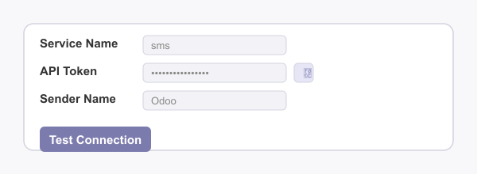
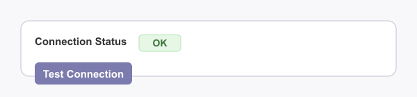
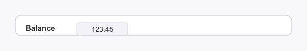
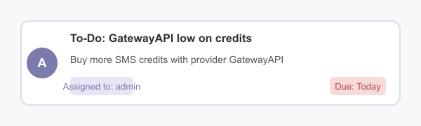

# GatewayAPI SMS Connector for Odoo 17

Send SMS messages directly from Odoo using the GatewayAPI service. This module replaces the default Odoo SMS IAP with a secure, feature-rich GatewayAPI integration.

---

## Features

- **Send SMS via GatewayAPI**: Seamless integration with GatewayAPI for reliable SMS delivery.
- **Secure API Token Management**: Show/hide your API token in the form with a single click.
- **Credit Balance Monitoring**: Set minimum credit thresholds and receive notifications when your balance is low.
- **Flexible Credit Check Scheduling**: Configure how often Odoo checks your GatewayAPI balance directly from the IAP Account form.
- **Admin Notifications**: Automatic admin alerts and activities when credits run low.
- **Easy Configuration**: Intuitive form layout and clear help texts.
- **Odoo 17 Compatible**: Built and tested for Odoo 17.

---

## Requirements

- **Odoo Apps**:  
  - `iap_alternative_provider`  
  - `phone_validation`
- **Python Packages**:  
  - `phonenumbers`  
  - `requests`

Install Python dependencies with:
```sh
pip install phonenumbers requests
```

---

## Installation

### From Odoo Apps Store

1. Download the module ZIP from the Odoo Apps Store.
2. Extract the ZIP and place the `gatewayapi_sms` folder in your Odoo `custom addons` directory.
3. Restart your Odoo server.
4. Activate Developer Mode in Odoo.
5. Go to Apps, click 'Update Apps List', then search for **GatewayAPI SMS Connector** and install it.

### From GitHub

1. Clone the repository:
   ```sh
   git clone https://github.com/waltherB/gatewayapi_sms.git
   ```
2. Move the `gatewayapi_sms` folder to your Odoo `addons` or `custom addons` directory.
3. Install the required Python packages (see above).
4. Restart your Odoo server.
5. Activate Developer Mode in Odoo.
6. Go to Apps, click 'Update Apps List', then search for **GatewayAPI SMS Connector** and install it.

---

## Configuration

1. Go to **Settings > Technical > GatewayAPI SMS Accounts** or **IAP > IAP Accounts**.
2. Click **Create GatewayAPI Account** to create a new account.
3. Fill in the required fields:
   - **Name**: Give your account a name (e.g., "GatewayAPI")
   - **Service Name**: Must be `sms`.
   - **GatewayAPI Base URL**: Default is `https://gatewayapi.eu`
   - **Sender Name**: Set your preferred sender name.
   - **API Token**: Obtain from your GatewayAPI dashboard.
   - **Minimum Credits**: Set a threshold for low credit notifications.
   - **Credit Check Interval**: Configure how often to check your balance.
4. Click **Test Connection** to verify your setup. The result will be shown in the *Connection Status* field.
5. Use the eye/eye-slash button to show/hide your API token securely.

---

## Usage

- Send SMS from Odoo using the GatewayAPI provider.
- Receive admin notifications when your credit balance drops below your set threshold.
- All configuration and scheduling is managed from the IAP Account form—no need to edit Scheduled Actions manually.

---

## Screenshots

| Configuration | Test Connection | Notification | Balance |
|---------------|----------------|--------------|---------|
|  |  |  |  |

### Example: Low Credits Notification Activity

This is what the admin will see in the Odoo activity stream when credits fall below the minimum threshold:



---

## Low Credits Notification

The email notification for low credits is not a traditional email, but rather an Odoo activity that appears in the admin's activity stream. This is configured in your module as follows:

- When your GatewayAPI credits fall below the minimum threshold, the system triggers the server action `model_iap_account_action_low_tokens`.
- This action creates a To-Do activity for the admin user with:
  - **Summary:** "GatewayAPI low on credits"
  - **Note:** "Buy more SMS credits with provider GatewayAPI"

**What the notification looks like:**
- The admin will see a new activity in the Odoo chatter (and in their activity dashboard) with the above summary and note.
- The activity is not a direct email, but Odoo can be configured to send email reminders for pending activities, so the admin may receive an email with the same content if reminders are enabled.

Example:


---

## Credits

- Inspired by [smsapisi-odoo/smsapisi_connector](https://github.com/waltherB/smsapisi-odoo/tree/17.0/smsapisi_connector)
- Developed by [Walther Barnett](https://github.com/waltherB)

---

## License

AGPL-3
